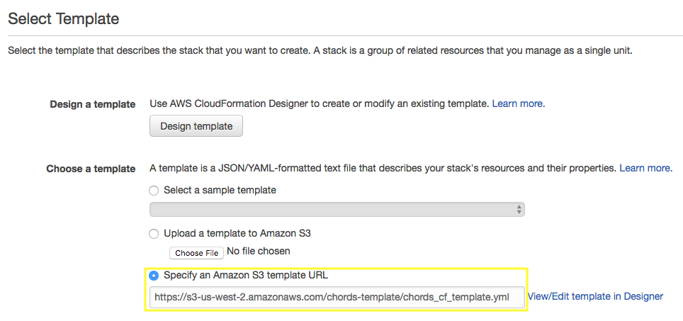
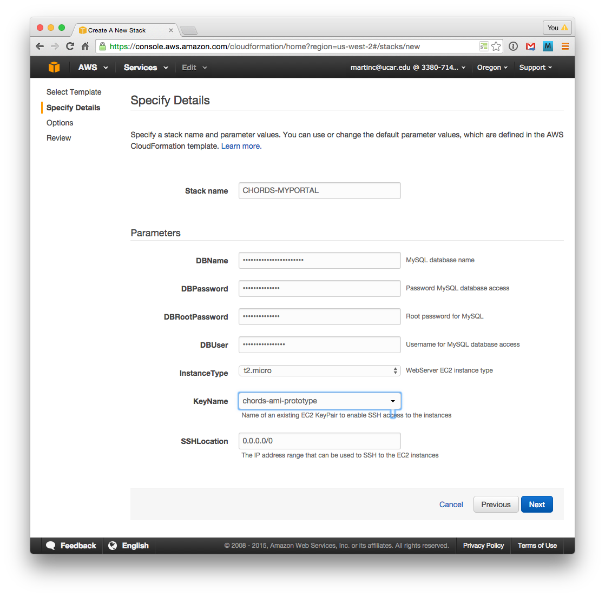
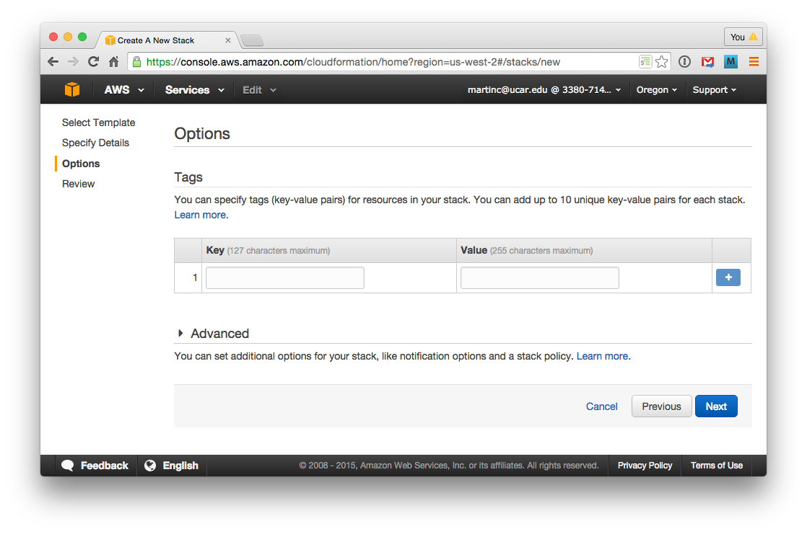
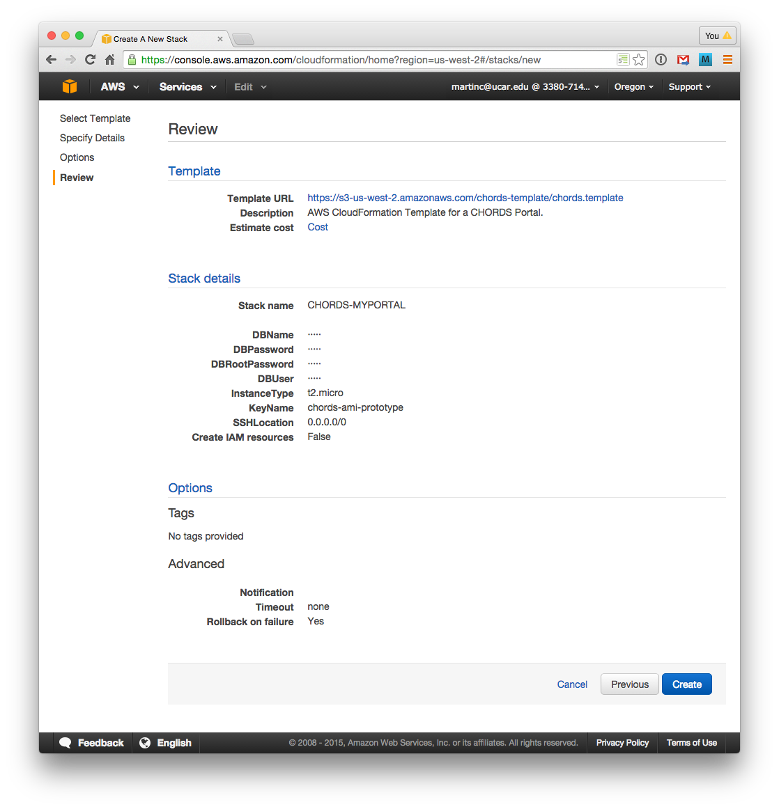
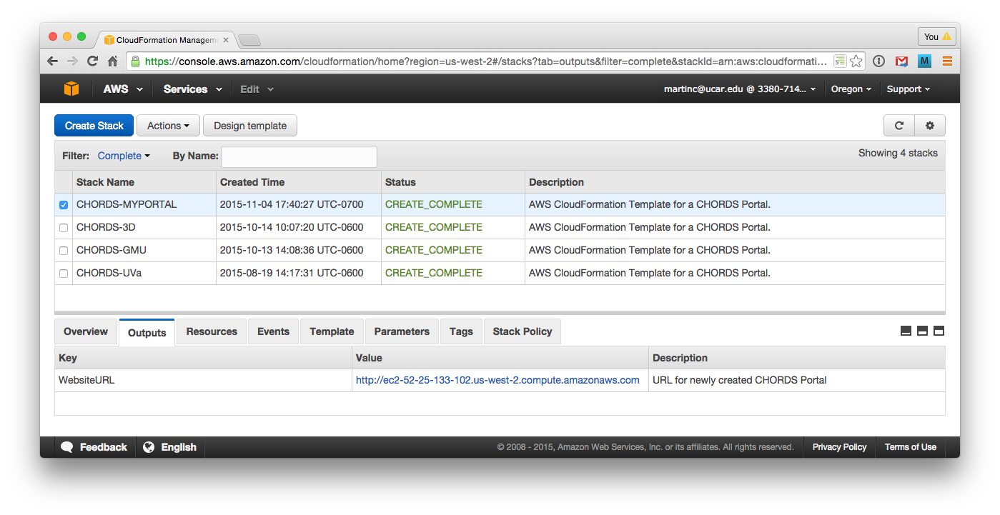
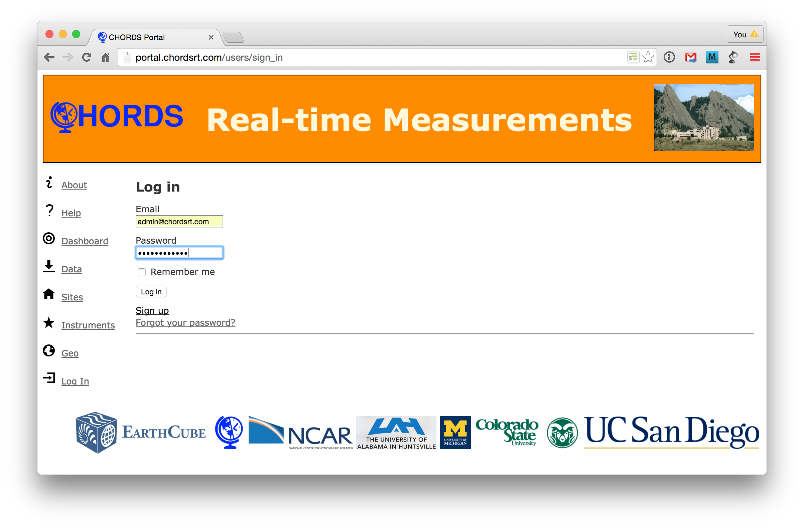

K---
layout: page
title: Creating a new CHORDS Portal on Amazon Web Services
---

# 1. CloudFormation Front Page

* Mash *Create Stack* to start the CloudFormation wizard.

# 2. Specify A Template

* Paste the following link into _Specify an S3 template URL_:  
https://s3-us-west-2.amazonaws.com/chords-template/chords.template

# 3. Specify the Portal Name and Key

* Give the stack a name. The convention is _CHORDS-_ suffixed with your project or organization name, e.g. _CHORDS-CSURadar_.
* Select an EC2 KeyPair for *KeyName*. This will allow you to ssh into the instance, if ever needed.

# 4. Options

* Next.

# 5. Review

* Verify that everything looks good.
* Mash the *Create* button.

# 6. Wait for Portal to be created

* After the creation has started, you will be taken 
to the stack summary page. Go to the *Events* tab to watch the progress 
of the stack creation. It usually takes about 4 minutes to complete, but it can take 
much longer (even 30 minutes), depending upon AWS loads.

# 7. Access the new Portal

* Once the portal is created and running, the *Outputs* tab will provide a WebsiteURL for the new 
CHORDS Portal. Click on the link to access the Portal.

# 8. Log Into to Your CHORDS Portal

* Log into your new portal, as user *admin*, password *admin*.

# If something breaks
* If the provisioning fails, the instance will be stopped, and you won\'t know why. You can redo the process, 
and disable the rollback, so that the instance is left running. To do this, when on the *Options* page, 
open the Advanced section, and change _Rollback on Failure_ to *No*. This will
keep the instance running when the provisioning fails, so that you can ssh in and diagnose the problem.
